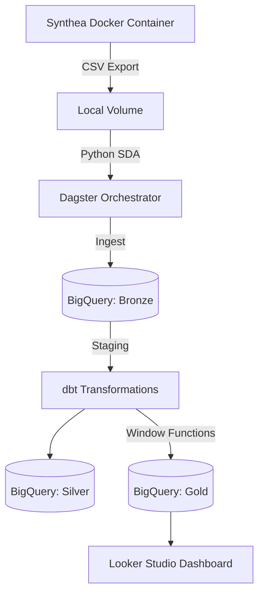

# Boston Hospital Readmission Pipeline

[](#) [](#)

A containerized data pipeline tracking 30-day hospital readmissions from synthetic EHR data. It extracts raw records, natively ingests them into BigQuery via Dagster, and transforms them into a dimensional model using dbt. 

Built to solve a specific problem: creating a clean, reproducible "Single Source of Truth" for clinical executives without over-engineering the backend.

## Visual Proof


## Architecture



## Quick Start

### Prerequisites
* Docker & Docker Compose
* Google Cloud Platform (GCP) account with BigQuery enabled
* GCP Service Account JSON key (`BigQuery Data Editor` & `BigQuery Job User`)

### Environment Variables
Create a `.env` file in the repository root:

| Variable | Description | Example |
|---|---|---|
| `GOOGLE_APPLICATION_CREDENTIALS` | Absolute path to your GCP JSON key | `/opt/dagster/app/.secrets/key.json` |
| `GCP_PROJECT_ID` | Your GCP Project ID | `boston-hospital-pipeline` |

### Run the Pipeline

1. Clone the repository and navigate to the root directory.
2. Build and start the containers:
```bash
docker-compose up --build
```
3. Open `http://localhost:3000` in your browser.
4. Click **Materialize All** to execute the ingestion and transformation DAG.

## Engineering Decisions & Trade-offs (ADRs)

**1. Dagster over standalone Python scripts**
* **Context**: Raw data needed to be pushed to BigQuery reliably.
* **Decision**: Wrote ingestion logic as native Dagster Software-Defined Assets (SDAs).
* **Consequences**: Gained automatic data lineage, deep execution metadata, and prevented downstream dbt models from running if upstream ingestion failed.

**2. dbt/SQL over Pandas for Transformations**
* **Context**: Needed to calculate complex 30-day readmission gaps. 
* **Decision**: Pushed transformation logic down to the data warehouse using dbt and standard SQL window functions rather than computing in-memory with Python.
* **Consequences**: Achieved highly practical, industry-standard familiarity with SQL. The pipeline remains scalable, and the visualization layer (Looker) acts only as a lightweight display rather than a compute engine.

## Technical Challenges

**Securing CI/CD Automated Linting**
* **Situation**: The GitHub Actions pipeline using SQLFluff failed because the `dbt templater` required GCP credentials to compile the project and understand `{{ ref() }}` macros.
* **Task**: Unblock the automated code review pipeline without exposing sensitive Google Cloud keys to the public repository.
* **Action**: Configured GitHub Secrets to securely hold the JSON key. Updated the `sqlfluff-lint.yml` workflow to dynamically inject the secret into a temporary file on the runner environment exclusively during the linting execution.
* **Result**: Achieved fully automated, strict SQL formatting enforcement on the `main` branch with zero security leaks.

<details>
<summary>Click to view core readmission logic (dbt Window Functions)</summary>

```sql
-- Utilizing LAG() to find the chronological gap between patient visits
visit_history AS (
    SELECT
        encounter_id,
        patient_id,
        encounter_start_datetime,
        encounter_class,
        LAG(encounter_start_datetime) OVER (
            PARTITION BY patient_id 
            ORDER BY encounter_start_datetime
        ) AS previous_encounter_start
    FROM base_encounters
    WHERE encounter_class IN ('inpatient', 'emergency')
)
```
</details>

---
